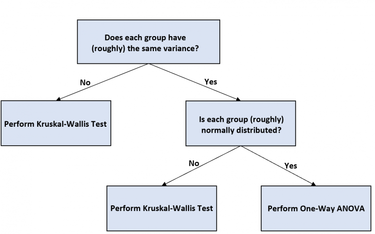

```{r setup, include=FALSE}
library(knitr)
knitr::opts_chunk$set(echo = TRUE)
library(tidyverse)
library(lubridate)
library(gridExtra)
require(nortest)
options(dplyr.summarise.inform = FALSE)
options(knitr.kable.NA = '')
set.seed(0)
```


# Uvod

Tenis je jedan od najpopularnijih sportova današnjice, s turnirima koji se održavaju tijekom cijele godine i milijunima gledatelja. Jedna od zanimljivosti tenisa je količina podataka dostupna o pojedinim mečevima. Igrači već godinama koriste podatke o brzini protivničkih servisa i drugih udaraca, te raspodjeli njihovih udaraca kako bi pronašli slabosti u protivnikovoj igri. Danas se to dodatno proširuje novim mjerama, poput brzine vrtnje loptice.
U ovom projektu bavit ćemo se raspodjelom teniskih mečeva po podlogama po godišnjim dobima. Zatim ćemo proučavati postoji li razlika u prosječnom broju dvostrukih pogrešaka u ovisnosti o tome igra li se meč na otvorenom ili u dvorani. Pokušat ćemo otkriti postoji li razlika u broju aseva na različitim podlogama te postoji li veza između vrste terena i vjerojatnosti da će meč otići u peti set. Na kraju, pokušat ćemo procijeniti broj aseva koji će igrač odservirati u tekućoj sezoni pomoći njegovih statistika iz prošlih sezona.
\newpage

# Analiza

## Skup podataka

O ovom poglavlju obavit ćemo učitavanje podataka o svim mečevima i spojiti ih u jednu tablicu.
Podatke učitavamo sljedećom naredbom:
```{r data}
matches <- data.frame()
for (year in 1968:2023){
  csv.name <- paste0("./ATP-Matches/atp_matches_", year, ".csv")
  year.data <- read.csv(csv.name)
  matches <- rbind(matches, year.data)
}
colnames(matches)
```
Vidimo da su nam dostupni podaci i o turniru i o igračima.

Za turnir imamo sljedeće:

- jedinstveni identifikator turnira
- ime turnira, odnosno mjesto na kojem se turnir održava
- podloga na kojoj se turnir igra
- broj igrača na turniru
- razina turnira

Za igrače i odigrani meč imamo sljedeće podatke:

- broj meča
- identifikator igrača
- mjesto igrača na ljestvici, turnirskoj i ATP
- ime igrača
- ruka s kojom igra
- visina igrača
- državu koju igrač predstavlja
- starost igrača
- način ulaska u turnir (ukoliko je važan, npr WC za pozvane tzv. "wildcard igrače")
- rezultat meča, uključujući i maksimalni broj setova i kolo koje se igralo

Primjećujemo da su podaci dostupniji za moderne mečeve.
Na kraju su uključene i brojne statistike za mečeve nakon 1990., za svakog igrača:

- broj aseva
- broj dvostrukih pogrešaka
- postotak servisa
- postotak prvog servisa
- postotak dobivenih poena na prvom i drugom servisu
- broj osvojenih servisnih gemova
- broj spašenih break-lopti
- broj prilika za uzimanje servisa koje je protivnik imao
  
## Odnos podloge na kojoj se odigrao meč i godišnjeg doba

Kako bi doznali traženi odnos, moramo prvo obaviti potrebne transfomacije skupa podataka.
Prvo iz originalnog skupa podataka uzimamo samo podlogu i datum turnira te izbacujemo redove koji te podatke nemaju. Zatim te podatke mijenjamo u tipove podataka s kojima je lakše baratati, factor za podlogu i Date za datum. Zatim dodajemo stupac koji predstavlja godišnje doba, te postavljamo i taj stupac kao factor.
```{r}
matches.f <- matches %>% select(surface, tourney_date) %>% filter(!is.na(tourney_date) & surface != "")
matches.f$surface <- as.factor(matches.f$surface)
matches.f$tourney_date <- as.Date(as.character(matches.f$tourney_date), format("%Y%m%d"))
matches.f <- matches.f %>% mutate(tourney_season = case_when(
  month(tourney_date) %in% c(12,1,2) ~ "Zima", 
  month(tourney_date) %in% c(3,4,5) ~ "Proljece", 
  month(tourney_date) %in% c(6,7,8) ~ "Ljeto",
  month(tourney_date) %in% c(9,10,11) ~ "Jesen"))
matches.f$tourney_season <- as.factor(matches.f$tourney_season)
kable(summary(matches.f))
```

Iz pregleda podataka možemo vidjeti da se najviše mečeva igra za vrijeme proljeća i ljeta, te da se mečevi najviše igraju na tvdim podlogama i na zemlji. Te ćemo podatke pregledno prikazati koristeći heatmap graf, gdje se intenzivnijim bojama prikazuju podaci koji su prisutniji.

Kako bi se podaci mogli prikazati koristeći heatmap() fuknciju, prvo je potrebno transformirati podatke u matricu. To radimo tako da prvo zbrojimo podatke grupirajući ih po godišnjem dobu i podlozi. Zatim stvaramo imenovane vektore po godišenjem dobu, koje grupiramo u konačnu matricu.
```{r}
df.count <- matches.f %>% group_by(tourney_season, surface) %>% summarise(count = n()) %>% ungroup()
pivot.table <- df.count %>% spread(surface, count, fill = 0)
zima <- pivot.table %>% select (-tourney_season) %>% slice(4) %>% unlist()
proljece <- pivot.table %>% select (-tourney_season) %>% slice(3) %>% unlist()
ljeto <- pivot.table %>% select (-tourney_season) %>% slice(2) %>% unlist()
jesen <- pivot.table %>% select (-tourney_season) %>% slice(1) %>% unlist()

match.matrix <- cbind(zima, proljece, ljeto, jesen)
heatmap(match.matrix, Colv = NA, Rowv = NA, scale = "none", margins = c(8, 8), 
        xlab = "Godisnje doba", ylab = "Vrsta podloge")
```

Nakon toga prikazujemo kako izgleda raspodjela po godišnjim dobima za pojedinu podlogu.
```{r}
plot1 <- ggplot(pivot.table, aes(x=tourney_season, y=Carpet, fill=tourney_season)) + geom_bar(stat = "identity", show.legend = FALSE) + geom_text(aes(y = (Carpet + 500), label = tourney_season), color = "black", size=6) + theme(axis.ticks.y = element_blank(), axis.ticks.x = element_blank(), axis.text.x = element_blank(), axis.title.x = element_blank())

plot2 <- ggplot(pivot.table, aes(x=tourney_season, y=Hard, fill=tourney_season)) + geom_bar(stat = "identity", show.legend = FALSE) + geom_text(aes(y = (Hard + 1100), label = tourney_season), color = "black", size=6) + theme(axis.ticks.y = element_blank(), axis.ticks.x = element_blank(), axis.text.x = element_blank(), axis.title.x = element_blank())

plot3 <- ggplot(pivot.table, aes(x=tourney_season, y=Clay, fill=tourney_season)) + geom_bar(stat = "identity", show.legend = FALSE) + geom_text(aes(y = (Clay + 1500), label = tourney_season), color = "black", size=6) + theme(axis.ticks.y = element_blank(), axis.ticks.x = element_blank(), axis.text.x = element_blank(), axis.title.x = element_blank())

plot4 <- ggplot(pivot.table, aes(x=tourney_season, y=Grass, fill=tourney_season)) + geom_bar(stat = "identity", show.legend = FALSE) + geom_text(aes(y = (Grass + 1000), label = tourney_season), color = "black", size=6) + theme(axis.ticks.y = element_blank(), axis.ticks.x = element_blank(), axis.text.x = element_blank(), axis.title.x = element_blank())

grid.arrange(plot1, plot2, plot3, plot4, ncol = 2)
```

Za mečeve na tepihu vidimo da se igra ju u svakom godišnjem dobu, osim za vrijeme ljeta. To možemo objasniti time da su takvi tereni obično unutra, za što nema potrebe tijekom ljeta zbog pogodnog vremena na otvorenom. Za tvrde podloge možemo vidjeti da se igraju tokom cijele godine, što ima smisla, s obzirom na činjenicu da tvrdih podloga ima mnogo, zbog relativno laganog održavanja u svim uvjetima. Za zemljane podloge vidimo da se najviše igraju za vrijeme proljeća i ljeta, što odgovara činjenici da su ti tereni najčešće na otvorenom. Mečevi se na travnatim podlogama igraju gotovo isključivo tijekom ljeta. To možemo objasniti da takvih terena nema puno, pa se većina mečeva igra kao priprema za Grand Slam turnir na travi, Wimbledon.

Zatim možemo pogledati raspodjelu podloga u ovisnosti o godišnjem dobu.
Za to možemo iskoristiti matricu napravljenu za heatmap kako bi dobili obrnuti dataframe od onog korištenog u prethodnom dijelu. Boje za podloge u grafu uzeli smo iz boja terena na Grand Slam turnirima.

```{r}
t.pivot.table <- data.frame(match.matrix) %>% rownames_to_column(var = "surface")

plot1 <- ggplot(t.pivot.table, aes(x=surface, y=zima, fill=surface)) + geom_bar(stat = "identity", show.legend = FALSE) + scale_fill_manual(values=c("grey", "#AA4A44", "#84B118", "#3C638E")) + xlab(NULL)
plot2 <- ggplot(t.pivot.table, aes(x=surface, y=proljece, fill=surface)) + geom_bar(stat = "identity", show.legend = FALSE) + scale_fill_manual(values=c("grey", "#AA4A44", "#84B118", "#3C638E")) + xlab(NULL)
plot3 <- ggplot(t.pivot.table, aes(x=surface, y=ljeto, fill=surface)) + geom_bar(stat = "identity", show.legend = FALSE) + scale_fill_manual(values=c("grey", "#AA4A44", "#84B118", "#3C638E")) + xlab(NULL)
plot4 <- ggplot(t.pivot.table, aes(x=surface, y=jesen, fill=surface)) + geom_bar(stat = "identity", show.legend = FALSE) + scale_fill_manual(values=c("grey", "#AA4A44", "#84B118", "#3C638E")) + xlab(NULL)

grid.arrange(plot1, plot2, plot3, plot4, ncol = 2)
```

Neke zanimljivosti možemo primjetiti: po zimi i jeseni dominiraju tvrde podloge, često zato što su najprikladnije za zatvorene uvjete, gdje se često održavaju turniri u tim godišnjim dobima zbog neprikladnog vremena vani. Prisutnost ostalih možemo objasniti održavanjem turnira u toplijim državam i južnoj hemisferi, gdje je vrijeme pogodno za vanjske turnire i kada je u Europi zima. Zemljane podloge dominiraju u proljeće, kada su najprikladniji uvjeti za igru u mediteranskim zemljama gdje se takvi tereni često nalaze. Tijekom ljeta prisutne su sve vrste podloga, no najveći skok od ostalih godišnjih doba rade travnate podloge.

Zatim možemo pogledati raspodjelu mečeva tokom cijele godine:
```{r}
matches.f$tourney_yday <- yday(matches.f$tourney_date)

ggplot(matches.f, aes(x = tourney_yday)) +
  geom_vline(aes(xintercept = 22), col = "#377DB8", linewidth = 2) +
  annotate("text", x = 17, y = 0.002, label = "AUS Open", angle = 90) +
  geom_vline(aes(xintercept = 155), col = "#AA4A44", linewidth = 2) +
  annotate("text", x = 150, y = 0.002, label = "Roland Garros", angle = 90) +
  geom_vline(aes(xintercept = 184), col = "#84B118", linewidth = 2) +
  annotate("text", x = 179, y = 0.002, label = "Wimbledon", angle = 90) +
  geom_vline(aes(xintercept = 250), col = "#3C638E", linewidth = 2) +
  annotate("text", x = 245, y = 0.002, label = "US Open", angle = 90) +
  geom_vline(aes(xintercept = 320), col = "lightblue4", linewidth = 2) +
  annotate("text", x = 315, y = 0.002, label = "ATP Finals", angle = 90) +
  geom_density() +
  xlab("Dan u godini") +
  ylab(NULL) +
  theme(axis.text.y = element_blank(), axis.ticks.y = element_blank())
``` 
Primjećujemo da se najviše turnira održava u danima nakon Wimbledona, tijekom ljeta, te jako pada pri kraju godine. To ima smisla uzevši u obzir da je tenis najpopularniji u Europi, gdje su krajem godine uvjeti za igru dosta loši.
Jedna zanimljiva stvar koju uočavamo je da tijekom GS turnira broj mečeva padne u odnosu na broj mečeva neposredno prije i poslije. To možemo objasniti time da, pošto su to najvažniji turniri na teniskom kalendaru, gledatelji i sponzori su isključivo za njih zainteresirani, pa nije isplativo ogranizirati druge turnire, što rezultira time da se samo ti turniri održavaju i smanjuje se ukupan broj mečeva.

Ranije smo vidjeli da se tijekom ljeta u velikom broju prisutne tri podloge. Zanimljivo bi bilo otkriti kako su mečevi na tim podlogama raspodijeljeni tijekom ljeta. To radimo na sljedeći način:
```{r}
ljeto.grouped <- matches.f[matches.f$tourney_season == "Ljeto", ] %>% group_by(tourney_yday, surface) %>% summarise(num_matches = n())
ggplot(ljeto.grouped, aes(x=tourney_yday, y=num_matches, fill=surface)) + geom_area() + scale_fill_manual(values=c("grey", "#AA4A44", "#84B118", "#3C638E"))
```

Možemo vidjeti da početkom ljeta dominiraju travnate podloge. To su već ranije spomenuti "pripremni" turniri za Wimbledon i na kraju sam Wimbledon. Osim toga, mali broj mečeva na samom početku ljeta objašnjavamo time da se u to vrijeme igraju završni mečevi Roland Garossa.
Sredinom ljeta igraju se pretežito turniri na zemljanim podlogama. No, tijekom tog razdoblja vidimo i polagani rast turnira na tvrdoj podlozi, koji služe kao uvod za US Open, koji se održava krajem ljeta. Nakon njega ulazimo u jesen gdje dominiraju turniri na tvrdim podlogama, što možemo vidjeti u rastu mečeva pri kraju grafa.

## Razlika u broju dvostrukih pogrešaka između terena na otvorenom i zatvorenom prostoru

Postavlja se pitanje da li odabir terena ima utjecaj na učestalost dvostrukih pogrešaka.
Prvo izdvojimo relevante podatke, i grupiramo po vrsti terena (otvoreno ili zatvoreno), te
vizualiziramo podatke grafovima da vidimo pokazuju li na razliku. 

Uzeli smo podatke za godine 2010.-2023. koje koristimo kao reprezentativni skup. Trebamo ih podijeliti u dvije grupe: igre koje se događaju na otvorenom i na zatvorenom.

```{r}
data <- read.csv('ATP-Matches/atp_matches_2023.csv')
for (year in 2022:2010) {
  filepath <- paste0("ATP-Matches/atp_matches_", year, ".csv")
  data <- rbind(data, read.csv(filepath))
}
```

Nažalost, u našim podacima ne piše koje se igre događaju na otvorenom/zatvorenom prostoru. Određivanje terena je napravljeno ručno, prolaženjem kroz svaki turnament i gledanja na wikipediji da li se izvodi na otvorenom ili zatvorenom terenu. 

Prvo generiramo listu svih odigranih turnira, na sljedeći način:

```{r}
tournaments = select(data, c("tourney_name", "tourney_level"))
tournaments = tournaments[!duplicated(tournaments),]
tournaments = tournaments[!(tournaments$tourney_level %in% c("D", "G")),]
kable(head(tournaments))
```

Zatim, istaživanjem dobivamo listu turnira na zatvorenom. To su, redom: Rotterdam, Tokyo (samo u 2018. godini), Basel, Montpellier, Marseille, Stockholm, Moscow, Antwerp, Dallas, Metz, Laver Cup, Sofia, Tel Aviv, Astana, Gijon, Vienna, NextGen Finals, St. Petersburg, Nur-Sultan, Singapore, New York, Cologne 1, Cologne 2, Memphis, Zagreb, Kuala Lumpur, Valencia, San Jose, Bangkok. Zatim te turnire ubacujemo u jednu listu:

```{r}
# Lista svih turnamenta u unutarnjem terenu za potrebu razdvajanja igra - osim tokyo, koji    se posebno smatra
Indoor = c("Rotterdam", "Basel", "Montpellier", "Marseille", "Stockholm", "Moscow", "Antwerp", "Dallas", "Metz", "Laver Cup", "Sofia", "Tel Aviv", "Astana", "Gijon", "Vienna", "NextGen Finals", "St. Petersburg", "Nur-Sultan", "Singapore", "New York", "Cologne 1", "Cologne 2", "Memphis", "Zagreb", "Kuala Lumpur", "Valencia", "San Jose", "Bangkok")
```

Zatim ćemo odraditi neke potrebne transformacije podataka. Redom, izbacujemo mečeve koji su igrani u sklopu Davis Cup-a, zato što se oni igraju na mnogo lokacija i potrebno bi bilo jako puno istraživanja za relativno malen broj mečeva. Zatim iz datuma dobivamo godinu turnira, koja nam je potrebna za filtriranje. Nakon toga dodajemo stupac cat koji određuje mjesto igranja turnira. Zatim uzimamo relevantne stupce, izbacujemo stupce koji nemaju potrebne podatke, i zbajamo dvostruke pogreške pobjednika i gubitnika. Na kraju, odvajamo podatke u dvije posebne tablice.

```{r transformacije}
data <- data[data$tourney_level != "D", ]

data$tourney_year <- as.numeric(substr(as.character(data[, "tourney_date"]), 1, 4))

data$cat <- mapply(function(x,y) {if ((x %in% Indoor) || (x == "Tokyo" && y == 2018)) return("I") else return("O") }, data$tourney_name, data$tourney_year)

modifdata <- select(data, c("cat", "w_df", "l_df"))
modifdata <- na.omit(modifdata)
modifdata$df <- modifdata$l_df + modifdata$w_df

dataO <- modifdata[modifdata$cat == "O", "df"]
dataI <- modifdata[modifdata$cat == "I", "df"]
```


Sada možemo usporediti podatke koje smo dobili. Prvo uspoređujemo srednje vrijednosti numerički i vizualno, pomoću box plot-a.

```{r}
cat("Indoor mean:", mean(dataI), "\nOutdoor mean:", mean(dataO))
cat("\nIndoor median:", median(dataI), "\nOutdoor median:", median(dataO))

barplot(c(mean(dataI), mean(dataO)), names.arg = c("Indoor double faults", "Outdoor double faults"), main="Prosjecan broj dvostrukih pogresaka ovisno o terenu", col = c("Blue", "Red"))

boxplot(dataI, dataO, names = c("Indoor double faults", "Outdoor double faults"), main="Boxplot dvostrukih pogresaka ovisno o terenu")
```

Dok bi nam srednja vrijednost pokazivala na mogućnost razlike u prosjećnih dvostrukih pogrešaka između 2 terena, medijan i boxplot nam ne ukazuju na to, te boxplot otkriva zašto je tako: velika količina ekstremnih vrijednosti. Prvi korak je da ih maknemo. Koristimo Winsorizing da ih donekle uklonimo.
```{r}
dataOr = dataO
dataIr = dataI

dataOr[which(dataOr < quantile(dataOr, p = 0.01))] <- quantile(dataOr, p = 0.01)
dataOr[which(dataOr > quantile(dataOr, p = 0.99))] <- quantile(dataOr, p = 0.99)

dataIr[which(dataIr < quantile(dataIr, p = 0.01))] <- quantile(dataIr, p = 0.01)
dataIr[which(dataIr > quantile(dataIr, p = 0.99))] <- quantile(dataIr, p = 0.99)


cat("Indoor mean:", mean(dataIr), "\nOutdoor mean:", mean(dataOr))
cat("\nIndoor median:", median(dataIr), "\nOutdoor median:", median(dataOr))

boxplot(dataIr, dataOr, names = c("Indoor double faults", "Outdoor double faults"), main="Boxplot dvostrukih pogresaka ovisno o terenu transformiran log funkcijom")
```

Efekt ekstremnih vrijednosti je smanjen, te možemo fokusirati na test. Boxplot ne upućuje na razliku u broju dvostrukih pogrešaka između terena, no srednja vrijednost govori da ako postoji, više se događa na otvorenom prostoru. Tako slažemo hipotezu:
$$\begin{aligned}
H_0&: \mu_i = \mu_o \\
H_1&: \mu_i < \mu_o
\end{aligned}$$

Prije nego što možemo pokrenuti t-test, moramo zadovoljiti određene pretpostavke/uvjete.

1) Nezavisnost
Prvi uvjet je nezavisnost - za njega ne postoji poseban statistički test, nego se obično logički zaključi. U našem primjeru pretpostavljamo da su podaci iz otvorenog i zatvorenog prostora nezavisni.

2) Normalnost
Drugi uvjet je da podaci dolaze iz normalne distribucije. Postoje par načina za to provjeriti, glavnim među njima samo vizualno pomoću histograma i QQ-plota. Postoji i Shapiro-Wilk test, ali nije napravljen za tako velike količine podataka.

```{r}
#Outdoors
qqnorm(dataOr, pch = 1, frame = FALSE, main = "QQ plot nad podacima otvorenog terena")
qqline(dataOr, col = "steelblue")
hist(dataOr, main ="Distribucija podataka otvorenog terena")
#Indoors
qqnorm(dataIr, pch = 1, frame = FALSE, main = "QQ plot nad podacima zatvorenog terena")
qqline(dataIr, col = "steelblue")
hist(dataIr, main ="Distribucija podataka zatvorenog terena")

#BONUS: Shapiro-Wilk test nad smanjenim (reprezetativnom) skupu
cat("ShW test nad podacima otvrenog prostora\n")
tempO = sample(dataOr, 2000)
shapiro.test(tempO)
cat("ShW test nad podacima zatvorenog prostora\n")
tempI = sample(dataIr, 2000)
shapiro.test(tempI)
```

Grafovi ne izgledaju idealno (pokazuju da su iskošeni na lijevo), no pošto imamo veliku količinu podataka (i sam t-test je dost otporan/fleksibilan što se tiče normalnosti), možemo pretpostaviti normalnost zbog CGT-a.

3) Jednakost varijanca
Treći uvjet je ptetpostavka jednakosti varijanca, iako se ova pretpostavka ne mora nužni ispuniti (postoji verzija testa za takve slučaje). Prvo pogledamo varijancu naših podataka.

```{r}
cat("Var(igre na otvorenom):", var(dataOr), "\n")
cat("Var(igre u zatvorenom):", var(dataIr), "\n")

```
Varijance se čine različite, a pošto radimo sa velikim brojem podataka varijance su dosta stabilne (tj. varijance varijanci su jako niske), što upučuje na različite varijance. Provodimo test.

```{r}
var.test(dataOr, dataIr)
```
Zbog rezultata testa odbacujemo hipotezu da su varijance jednake.

Napokon možemo provesti naš test. Podsjetnik na hipotezu:
$$\begin{aligned}
H_0&: \mu_i = \mu_o \\
H_1&: \mu_i < \mu_o
\end{aligned}$$

```{r}
t.test(dataIr, dataOr, alt = "less", var.equal = FALSE)

conf = t.test(dataIr, dataOr, var.equal = FALSE)$conf.int[1:2]
cat("Bolji interval pouzdanosti:\n",
conf, "\n", sep = " ")
```
Test nam daje jako nisku p-vrijednost i ukazuje da je prosječna količina dvostrukih pogrešaka u zatvorenom prostoru uistinu manja od količine njih na otvorenom. Postoji mogućnost da zbog velikog broja podataka test nam pokazuje zanemarujuću razlike kao 
statistički značajne (iako i manji sample-ovi isto odbijaju nultu hipotezu).
U ovakvim slučajevima najbolje je gledati interval pouzdanosti: pošto sa većim brojem uzoraka postaje manji/stabilniji, možemo vidjeti kolka je otpilike razlika između naša 2 terena. Gornji interval ukazuje na razlike između prosječnog broja dvostrukih pogrešaka između 0.9924 i 1.1773: 
a) Kaže da razlike postoje.
b) Razlike se čini male, ali su i same srednje vrijednosti otprilike male: ~5 za zatvorene i ~6 za otvorene prostore - razlike između njih od 1 je je već 20% više dvostrukih pogrešaka na otvorenom terenu u usporedbi sa zatvorenim. 

Tako po intervalu možemo zaključiti da se na otvorenom prostoru prosječno događa između 19.85% i 23.54% više dvostrukih pogrešaka nego na zatvorenom prostoru (tj. prosječno se događa ~1 više dvostruka pogreška na otvorenom nego na zatvorenom). Nažalost, ne znam dovoljno o tenisu da zaključim je li ta razlika (praktički) značajna.


## Razlika u broju seviranih asova po različitim podlogama

Cilj zadatka je utvrditi da li različite vrste podloga/terena ima utjecaj na broj seviranih asova u igri. U svrhu toga koristiti će se jednofaktorski ANOVA test. Za početak moramo dohvatiti i obraditi podatke za analizu, grupirajući ih po vrsti podloge. Uzimaju se podaci iz godina 2015.-2023. kao reprezentativni skup.

```{r}
data <- read.csv('ATP-Matches/atp_matches_2023.csv')
for (year in 2022:2015) {
  filepath <- paste0("ATP-Matches/atp_matches_", year, ".csv")
  data <- rbind(data, read.csv(filepath))
}
```

Zatim ćemo odraditi potrebne transformacije. Prvo ćemo dodati stupac ace koji predstavlja ukupan broj aseva u meču. Zatim ćemo odabrati samo potrebne stupce, što su u ovom slučaju surface i ace. Također moramo maknuti sve nevažeće zapise (gdje je broj asova Na). Dodatno ćemo broj asova za svaku vrstu terena staviti u vlastite vektore za lakše korištenje.

```{r}
data$ace <- data$w_ace + data$l_ace

dataR <- select(data, c("surface", "ace"))
dataR = na.omit(dataR)

surf = dataR$surface
surf = surf[!duplicated(surf)]

#Funkcija u slučaju da moramo poslije osviježiti podatke
seper = function(dat) {
  dataH <<- dat[dat$surface == "Hard", "ace"]
  dataCl <<- dat[dat$surface == "Clay", "ace"]
  dataG <<- dat[dat$surface == "Grass", "ace"]
  dataCr <<- dat[dat$surface == "Carpet", "ace"]
}
seper(dataR)
```


Usporedimo sada prosječnu vrijednost (i medijan) za sve terene posebno.

```{r}
for (str in surf) {
  temp = dataR[dataR$surface == str, "ace"]
  cat("Podloga:", str, "\n Mean:", mean(temp), "Median:", median(temp), "\n\n")
}
boxplot(dataR$ace ~ dataR$surface, main= "Boxplot igara po vrsti terena", ylab = "Broj asova", xlab = "Vrsta podloge")
```

Nažalost imamo veliki broj ekstremnih vrijednosti kojih bi trebali minimizirati. Koristimo Trimming (ova metoda je odabrana posebno jer podaci sa najviše/največim ekstremnim vrijendostima isto tako imaju veći broj podataka od nekih drugih, što nije poželjno za ANOVA analizu - više o tome poslije.)

```{r}
#trimming
trim = function(dat) {
  up_q = quantile(dat, 0.9)
  low_q = quantile(dat, 0.1)

  dat[dat > up_q] = NA
  dat[dat < low_q] = NA
  return(na.omit(dat))
}
#reset data
seper(dataR)
dataH = trim(dataH)
dataCr = trim(dataCr)
dataG = trim(dataG)
dataCl = trim(dataCl)

build = function() {
  dat = data.frame(surface = "Hard", ace = dataH)
  temp = data.frame(surface = "Clay", ace = dataCl)
  dat = rbind(dat, temp)
  temp = data.frame(surface = "Grass", ace = dataG)
  dat = rbind(dat, temp)
  temp = data.frame(surface = "Carpet", ace = dataCr)
  dat = rbind(dat, temp)
  return(dat)
}
dataRl = build()

#odmah re-vizualiziramo
boxplot(dataRl$ace ~ dataRl$surface, main= "Boxplot broja asova po vrsti terena", ylab = "Broj asova", xlab = "Vrsta podloge")
```

Uspješno smo smanjili utjecaj ekstremnih vrijednosti.Gledanjem boxplot-a, Uočavamo moguće razlike između različitih grupa. Možemo definirati našu hipotezu:
$$\begin{aligned}
H_0&: \mu_H = \mu_{Cl} = \mu_G = \mu_{Cr} \\
H_1&: Nisu \ svi \ isti
\end{aligned}$$

Iako tehnički nije pretpostavka ANOVA testa, potrebno je pogledati relativne veličine skupova podataka za različite vrste terena, jer ANOVA test najbolje radi kada su veličine skupova blizu jedan drugog. Što su veličine različitije, to je statistička snaga testa slabija, te postaje manje otporan na pretpostavku jednake varijance. Za naš primjer imamo veličine uzoraka:

```{r}
for(str in surf) {
  cat("Veličina uzorka za teren", str, "je:", nrow(dataRl[dataRl$surface == str, ]), "\n")
}
barplot(c(NROW(dataH), NROW(dataCl), NROW(dataG), NROW(dataCr)), names = surf, main = "Velicine uzorka po vrsti podloge")
```

Veličine naših uzoraka su ekstremno različite, što stavlja u pitanje uopće korištenje ANOVA testa. Za daljnje upute koristit ćemo sljedeči graf:
```{r, fig.cap="Flow Chart"}

```

Pretpostavke za homogenost varijanci su sljedeće:

1) Nezavisnost
Pretpostavljamo da su igre međusobno nezavisne, jer nema direktne veze između njih (tehnički bi mogla postojati indirektna veza po igračima koji igraju na različitim terenima, ali se smatra zanemarivom)

2) Normalnost
Prvo ćemo provjeriti normalnost uzoraka. Provjeravamo vizualno pomoću histograma i QQ-plotova. (i pomoćno sa Shapiro-Wilk testom.)

```{r out.width="50%"}
for (str in surf) {
  hist(dataRl$ace[dataRl$surface == str], main = paste("Distribucija podataka na", str, "terenu"), xlab = "Broj asova")
  qqnorm(dataRl$ace[dataRl$surface == str], pch = 1, frame = FALSE, main = paste("QQ plot za podatke na", str, "terenu"))
  qqline(dataRl$ace[dataRl$surface == str], col = "steelblue")
}
#Bonus: Shapiro-Wilk test
cat("ShW test:\n")
cat(" Hard podloga:\n")
temp = sample(dataH, 2000)
shapiro.test(temp)
cat(" Clay podloga:\n")
temp = sample(dataCl, 2000)
shapiro.test(temp)
cat(" Grass podloga:\n")
temp = sample(dataG, 2000)
shapiro.test(temp)
cat(" Carpet podloga:\n")
shapiro.test(dataCr)
```

Histogrami pokazuju iskošenost na lijevo, i teške repove. Dok bi mogli tvrditi da je ANOVA test otporan u pitanju normalnosti i da zbog CGT-a ne normalna distribucija prva 3 terena ima manje učinka (veliki broj podataka), ne možemo isto tvrditi na Carpet podlozi koja ima mali broj podataka. Koristimo sqrt transformaciju nad podacima za naštimavanje podataka.

```{r}
datasqrt = dataRl
datasqrt$ace = sqrt(datasqrt$ace)
seper(datasqrt)
```

Ponovno gledamo grafove:

```{r out.width="50%"}
for (str in surf) {
  hist(datasqrt$ace[datasqrt$surface == str], main = paste("Distribucija podataka na", str, "terenu"), xlab = "Broj asova")
  qqnorm(datasqrt$ace[datasqrt$surface == str], pch = 1, frame = FALSE, main = paste("QQ plot za podatke na", str, "terenu"))
  qqline(datasqrt$ace[datasqrt$surface == str], col = "steelblue")
}

#Bonus: Shapiro-Wilk test
cat("ShW test:\n")
cat(" Hard podloga:\n")
temp = sample(dataH, 2000)
shapiro.test(temp)
cat(" Clay podloga:\n")
temp = sample(dataCl, 2000)
shapiro.test(temp)
cat(" Grass podloga:\n")
temp = sample(dataG, 2000)
shapiro.test(temp)
cat(" Carpet podloga:\n")
shapiro.test(dataCr)
```

Iako grafovi (većinom) izgledaju bolje, glavni problem, Carpet podloga, još uvijek nije blizu normalne distribucije. To nas vodi do 2 moguća rješenja: A) Uopće izbacivanje Carpet podloge iz napeg skupa, i provođenja ANOVA testa nad 3 preostala terena, ili B) prelazak na Kruskal-Wallis test. Prije donošenja odluke, prođimo 3. pretpostavku.

3) Homogenost varijanci

Uvjet koji je ovdje jako osjetljiv zbog velike razlike u brojevima podataka među uzorcima, moramo provjeriti da li su svim uzorcima varijance iste, tj.
$$ \begin{aligned}
  H_0 & : \sigma_H^2 = \sigma_{Cl}^2 = \sigma_G^2 = \sigma_{Cr}^2 \\
  H_1 & : \text{barem dvije varijance nisu iste}.
\end{aligned} $$
Prvo pogledajmo varijance samih uzoraka. (NOTE: još uvijek koristimo sqrt podatke)

```{r}
for(str in surf) {
  cat("Var(", str,") = ", var(datasqrt$ace[datasqrt$surface == str]), "\n", sep="")
}
```

Većina terena ima slične varijance, s tim da je najveći outlier Carpet, dovoljno veliki da upučuje da nehomogenost varijance. Konkretni test za provjeru homogenosti je Bartlettov test.

```{r}
bartlett.test(datasqrt$ace ~ datasqrt$surface)
```

Zbog niske p-vrijednosti dobijamo da su sve varijance iste. Time smo pali 2 pretpostavke ANOVA testa. Postoji par postupaka odavde.

### Prvi postupak - izbacivanje podataka za Carpet

Prvi postupak koji provodimo je ignoriranje Carpet podloge. Zbog premalog uzorka, tvrdimo da nemamo dovoljno informacije o igrama na tom terenu. (NOTE: još uvijek koristimo sqrt vrijednosti zbog bolje normalnosti)

```{r}
data1 = datasqrt[datasqrt$surface != "Carpet",]
seper(data1)
```

1. i 2. pretpostavku zadovaljavamo po gore navedenim razlozima, samo preostaje 3. pretpostavka - homogenost varijanci. Nažalost, veličine uzoraka su nam još uvijek vrlo različite. pa je test još uvijek osjetljiv na homogenost (iako ne koliko prije).

```{r}
bartlett.test(data1$ace ~ data1$surface)
```

Bartlett test nam daje da još uvijek je varijanca različita između uzoraka. Iako je to moguće zbog velikog broja podataka koji uvečava minijaturne razlike, zbog velike razlike u borju podataka između uzoraka, još uvijek smatramo da pretpostavka homogenosti nije prihvaćena.

### Drugi postupak - Kruskal-Wallis

Umjesto ANOVA testa, koristiti čemo neparametarsku verziju istog, Kruskal-Wallis test.
Večina njegovih pretpostavki već imamo potvrđeno (Nenormalna distribucija, nezavisnost, >5 podataka u uzorku). Jedina moguća pretpostavka je da uzorci imaju slične distribucije. Gledamo histograme. (napomena: uključujemo Carpet uzorak i ne-sqrt podatke)

```{r out.width="50%"}
data2 = dataRl
seper(data2)

for(str in surf) {
  hist(data2$ace[data2$surface == str], main = paste("Distribucija podataka na", str, "terenu"), xlab = "Broj asova")
}
```

Distribucije se čine poprilično slićne (največi outlier je vjerojatno Clay podloga), te smatramo i taj uvjet zadovoljen. Provodimo KW test. Podsjetnik na hipotezu: 
$$\begin{aligned}
H_0&: \mu_H = \mu_{Cl} = \mu_G = \mu_{Cr} \\
H_1&: Nisu \ svi \ isti
\end{aligned}$$

```{r}
cat("Podsjetnik:\n")
for (str in surf) {
  cat("Podloga:", str, "\n Mean:", mean(data2$ace[data2$surface == str]), "\n\n")
}

kruskal.test(data2$ace ~ data2$surface)
```

KW test nam kaže da srednje vrijednosti svih 4 podloga nisu iste, što potvrđuje što smo naslutili po boxplot-u.

```{r}
boxplot(data2$ace ~ data2$surface, main= "Boxplot igara po vrsti terena", ylab = "Broj asova", xlab = "Vrsta podloge")
```

No, možemo li vidjeti moguće grupe, tj. "uparene" srednje vrijednosti (srednje vrijednosti koje bi normalni t-test i/ili njegov neparametarski ekvivalent rekao da su isti)? Koristimo Pairwise uspoređujući Wilcox test.

```{r}
pairwise.wilcox.test(data2$ace, data2$surface, p.adjust.method = "BH")
```

Pairwise test nam pokazuje da Carpet i Clay podloge imaju otprilike istu srednju vrijednost, dok ostali imaju jako različite srednje vrijednosti.

### Treći postupak - Unity

Treći postupak je vjerojatno najkaotičniji. Uzet ćemo 400 podataka iz svakog uzorka i nad time provoditi ANOVA test- sample-at čemo iz prva 3 uzorka, i pretpostaviti da predstavljaju cijeli skup (kritična pretpostavka). Za Carpet teren, koristiti ćemo bootstrap da napušemo velik broj podataka koji pretpostavljamo da točno predstavljaju distribuciju iz koje dolaze (kritična pretpostavka!).

Prvo trebamo pripremiti podatke.

```{r}
seper(dataRl)

set.seed(0)
dataH = sample(dataH, 350)
dataCl = sample(dataCl, 350)
dataG = sample(dataG, 350)
dataCr = sample(dataCr, 350, replace = TRUE)

data3 = build()

```

Pogledajmo utjecaj toga na grafovima.

```{r out.width="50%"}
# za normalnost
for (str in surf) {
  hist(data3$ace[data3$surface == str], main = paste("Distribucija podataka na", str, "terenu"), xlab = "Broj asova")
  qqnorm(data3$ace[data3$surface == str], pch = 1, frame = FALSE, main = paste("QQ plot za podatke na", str, "terenu"))
  qqline(data3$ace[data3$surface == str], col = "steelblue")
}
```
```{r}
#boxplot
boxplot(data3$ace ~ data3$surface, main= "Boxplot igara po vrsti terena", ylab = "Broj asova", xlab = "Vrsta podloge")
```

Da približimo distribucije normalnoj, koristimo sqrt transformaciju podataka.

```{r}
data3$ace = sqrt(data3$ace)
seper(data3)
```

Ponovno gledamo grafove:

```{r out.width="50%"}
for (str in surf) {
  hist(data3$ace[data3$surface == str], main = paste("Distribucija podataka na", str, "terenu"), xlab = "Broj asova")
  qqnorm(data3$ace[data3$surface == str], pch = 1, frame = FALSE, main = paste("QQ plot za podatke na", str, "terenu"))
  qqline(data3$ace[data3$surface == str], col = "steelblue")
}
```
```{r}
boxplot(data3$ace ~ data3$surface, main= "Boxplot igara po vrsti terena", ylab = "Broj asova", xlab = "Vrsta podloge")
```

Histogrami bi se teško nazvali "normalni", ali zbog velikog broja podataka, te pošto smo već koristili KW test, pretpostavit ćemo relativnu normalnost.
Ostalo je samo odrediti homogenost varijanci.

```{r}
for(str in surf) {
  cat(" Var(", str,") = ", var(data3$ace[data3$surface == str]), "\n", sep="")
}
bartlett.test(data3$ace ~ data3$surface)
```

Homogenost još uvijek nije ni blizu potrebnom, uklanjamo Carpet podlogu ponovno.

```{r}
data4 = data3[data3$surface!="Carpet",]
seper(data4)

bartlett.test(data4$ace ~ data4$surface)
```

Po testu ne možemo odbaciti nultu hipotezu, pa pretpostavljamo jednakost varijanci.

Izvodimo ANOVA test. Podsjetnik na hipotezu:
$$\begin{aligned}
H_0&: \mu_H = \mu_{Cl} = \mu_G \\
H_1&: Nisu \ svi \ isti
\end{aligned}$$

```{r}
summary(aov(ace ~ surface, data = data4))
```

Test nam govori da srednje vrijednosti nisu iste na svim grupama, na što je boxplot i ukazao. Dodatno želimo provjeriti da li neki od njih imaju "uparene" srednje vrijednosti. Provjeravamo sa Pairwise t-testom.

```{r}
#vrijednosti
for (str in surf) {
  cat("Podloga:", str, "\n Mean:", mean(data4$ace[data4$surface == str]), "\n\n")
}

#test
pairwise.t.test(data4$ace, data4$surface, p.adj = "BH")
```

Vidimo da ni jedan od uzoraka međusobno ne dijeli srednju vrijednost, dajući slične rezultate kao KW test.


Korištenjem Kruskal-Wallis i ANOVA testa, pokazalo se da uistinu postoje razlike u serviranim asevima između različitih podloga. Naime, daljnom analizom pairwise testova, uspostavilo se da bi zemljana podloga i tepih mogli imati istu srednju vrijednost, no svi drugi su različiti jedan od drugog.
Ovaj zadatak i zaključak nema najbolju statističku snagu; zbog nenormalnosti podataka i razlike u veličini uzoraka, najprilagođeniji nam je bio Kruskal Wallis test, koji je u pravilu slabiji od ANOVA testa, ali ANOVA nije u potpunosti bio prigodan za naše podatke. Također se ukazala i neravnopravnost u odabiru terena: tvrdog terena ima daleko puno više od ostalih, a tepiha praktički više nema. 

Unatoč tome, uspjeli smo dobiti rezultate koje bi očekivali od boxplot-a i dobro opisuju naše podatke. Gledanjem po srednjim vrijednostima, možemo zaključiti da se najviše serviranih asova događa na travnom terenu, pa po tvrdom, i najmanje na tepihnom/glinenom terenu.


## Veza vrste terena i vjerojatnosti odlaska u peti set

U ovoj sekciji možemo se koristiti varijablom matches iz prvog dijela, koja sadržava skup svih podatka iz mečeva. Potrebno je obaviti transformacije kako bismo dobili jednu varijablu koja predstavlja je li meč ušao u peti set. Prvo moramo ograničiti podatke na mečeve koji su mogli ući u peti set, što možemo jednostavno pomožu varijable best_of. Zatim obavljamo potrebne transformacije za peti set te smanjujemo skup podataka na potrebne stupce.

```{r}
matches.f <- matches[matches$best_of == 5,]

x <- lapply(matches.f$score, function(x) {
  if(grepl("-", x)) {
    if(length(strsplit(x, "-")[[1]]) == 6) {
      return("yes")
    } else {
      return("no")
    }
  } else {
    return("x")
  }
})

matches.f$fifth_set <- unlist(x)
matches.f <- matches.f %>% select(surface, fifth_set)

matches.f <- filter(matches.f, fifth_set != "x", surface != "")

matches.f$surface <- factor(matches.f$surface)
```

Zatim radimo kontingencijsku tablicu za dobivene mečeve te provodimo \( \chi^2 \) test.
```{r}
contingency_table <- table(matches.f$fifth_set, matches.f$surface)
contingency_table


chi_square_test <- chisq.test(contingency_table)
chi_square_test
```


Koristeći Pearsonov chi-kvadrat test dobili smo p-vrijednost manju od 0.05 pa zaključujemo da odlazak meča u peti set stvarno ovisi o podlozi.


## Predviđanje broja aseva po rezultatima iz prošlih sezona

U ovom zadatku pokušat ćemo predvidjeti broj aseva iz u tekućoj sezoni po rezultatima iz prošlih.
Prvo ćemo pokušati predvidjeti samo na temelju broja aseva iz prošlih sezona.

Obavljamo potrebne transformacije kako bi dobili igrače i njihov ukupan broj aseva u tekućoj sezoni.

```{r}
unfiltered.2023.data <- read.csv('ATP-Matches/atp_matches_2023.csv')
filtered.2023.data <- unfiltered.2023.data %>% filter(!(is.na(w_ace) | is.na(l_ace)))
id.aces.2023 <- select(filtered.2023.data, winner_id, w_ace, loser_id, l_ace)

aces.2023.long.w <- id.aces.2023 %>% gather(key = "result_type", value = "aces", w_ace) %>% select(player_id = winner_id, aces)

aces.2023.long.l <- id.aces.2023 %>% gather(key = "result_type", value = "aces", l_ace) %>% select(player_id = loser_id, aces)

aces.2023 <- bind_rows(aces.2023.long.l, aces.2023.long.w) %>% group_by(player_id) %>% summarize(total_aces = sum(aces, na.rm = TRUE))

names(aces.2023)[names(aces.2023) == "total_aces"] <- "a2023"
kable(head(aces.2023))
```

Zatim na to dodajemo rezultate do 2015. godine.

```{r transformacije nastavak}

for (year in 2022:2015) {
  
  file.path <- paste0("ATP-Matches/atp_matches_", year, ".csv")
  matches.data <- read.csv(file.path) %>% filter(!(is.na(w_ace) | is.na(l_ace)))
  matches.data.subset <- select(matches.data, winner_id, w_ace, loser_id, l_ace)
  
  aces.long.w <- matches.data.subset %>% select(player_id = winner_id, aces = w_ace)

  aces.long.l <- matches.data.subset %>% select(player_id = loser_id, aces = l_ace)

  aces <- bind_rows(aces.long.l, aces.long.w) %>% group_by(player_id) %>% 
    summarize(total_aces = sum(aces, na.rm = TRUE))

  col.name <- paste0("a", year)
  names(aces)[names(aces) == "total_aces"] = col.name
  aces.2023 <- merge(aces.2023, aces, by = "player_id", all.x = TRUE)
  
}
aces.2023[is.na(aces.2023)] <- 0
kable(head(aces.2023))
```

Prvo radimo jednostavne modele na temelju nekoliko prošlih sezona:
```{r}
fit.2022 <- lm(a2023~a2022, data = aces.2023)
fit.2021 <- lm(a2023~a2021, data = aces.2023)
fit.2020 <- lm(a2023~a2020, data = aces.2023)


summary(fit.2022)

summary(fit.2021)

summary(fit.2020)
```
Vidimo da najbolje rezultate daje model na temelju prethodne sezone, te da se pogoršavaju što više idemo u prošlost. Iz vrijednosti F statistike možemo zaključiti da su modeli značajni, tj. bolje predviđaju podatke od nul-modela.

Normalnost reziduala provjeravamo QQ grafovima i KS testom (uz Lilliefors korekciju).
```{r reziduali}
qqnorm(rstandard(fit.2022), main = "Kvantili za 2022")
qqline(rstandard(fit.2022))

qqnorm(rstandard(fit.2021), main = "Kvantili za 2021")
qqline(rstandard(fit.2021))

qqnorm(rstandard(fit.2020), main = "Kvantili za 2020")
qqline(rstandard(fit.2020))

lillie.test(rstandard(fit.2022))

lillie.test(rstandard(fit.2022))

lillie.test(rstandard(fit.2020))
```

Dobiveni rezultati pokazuju da reziduali najvjerojatnije nisu iz normalne distribucije. No, zbog količine podataka i robusnosti t-testa na nenormalnost, i dalje možemo dobiti potencijalno korisne modele.

Prije nego što uključujemo druge varijable u model, moramo provjeriti jesu li te varijable previše korelirane. U tu svrhu radimo korelacijsku tablicu za sve podatke:
```{r}
cor(cbind(aces.2023$a2022, aces.2023$a2021, aces.2023$a2020 ,aces.2023$a2019, aces.2023$a2018, aces.2023$a2017, aces.2023$a2016, aces.2023$a2015))
```
Vidimo da je broj aseva u godini manje koreliran što su godine udaljenije, što je i očekivano.

S obzirom na to da želimo što novije podatke, jer će oni biti relevantiji za traženu sezonu, uzimamo 2022 (kao najznačajniju), pa onda prva s kojom ona korelira s manje od 0.7, pa tako dalje u prošlost. Dobivaju se godine 2022, 2020 i 2018.

```{r}
fit.adjusted <- lm(a2023 ~ a2022 + a2020 + a2018, data = aces.2023)
summary(fit.adjusted)
```

Vidimo slične vrijednosti \( \text{R}^2 \) kao za fit.2022 (zasad najbolji model), ali nižu vrijednost F-statisktike, što znači da je i dalje najkvalitetniji model za predviđanje aseva u tekućoj sezoni broj aseva iz prošle. Da takvi modeli daju dobre rezultate možemo provjeriti na još nekoliko godina (barem za igrače iz 2023):
```{r nove godine}
fit.old.2022 <- lm(a2022 ~ a2021, data = aces.2023)
summary(fit.old.2022)

fit.old.2021 <- lm(a2021 ~ a2020, data = aces.2023)
summary(fit.old.2021)

fit.old.2020 <- lm(a2020 ~ a2019, data = aces.2023)
summary(fit.old.2020)
```

Sva tri dobivena modela daju dobre rezultate, što možemo vidjeti iz vrijednosti r2 i F-statistike.
Neki od mogućih razloga koje naš model ne može objasniti je utjecaj različit broja odigranih mečeva na ukupan broj aseva, bilo zbog ozljede ili bilo čega drugog. No, rezultati modela ipak pokazuju da se uključivanjem starijih sezona gubi veći broj podataka nego li što se nadoknađuje time da može uprosječiti broj aseva kroz sezone.

Pokušajmo s nekim dodatnim varijablama, dodat ćemo podatke za dvostruke pogreške (ukupan broj) i postotak servisa (prosječan).
```{r}
aces.ex <- bind_rows(aces.2023.long.l, aces.2023.long.w) %>% group_by(player_id) %>% summarize(total_aces = sum(aces, na.rm = TRUE))
names(aces.ex)[names(aces.ex) == "total_aces"] = "a2023"

for (year in 2022:2020) {
  
  file.path <- paste0("ATP-Matches/atp_matches_", year, ".csv")
  matches.data <- read.csv(file.path) %>% filter(!(is.na(w_ace) | is.na(l_ace)))
  matches.data.subset <- select(matches.data, winner_id, w_ace, w_df, w_svpt, loser_id, l_ace, l_df, l_svpt)
  aces.long.w <- matches.data.subset %>% select(player_id = winner_id, aces = w_ace, dfs = w_df, svpt = w_svpt)

  aces.long.l <- matches.data.subset %>% select(player_id = loser_id, aces = l_ace, dfs = l_df, svpt = l_svpt)

  aces <- bind_rows(aces.long.l, aces.long.w) %>% group_by(player_id) %>% summarize(total_aces = sum(aces, na.rm = TRUE), total_df = sum(dfs, na.rm = TRUE), avg_svpt = mean(svpt, na.rm = TRUE))

  col.name <- paste0("a", year)
  names(aces)[names(aces) == "total_aces"] = col.name
  col.name <- paste0("df", year)
  names(aces)[names(aces) == "total_df"] = col.name
  col.name <- paste0("sv", year)
  names(aces)[names(aces) == "avg_svpt"] = col.name
  aces.ex <- merge(aces.ex, aces, by = "player_id", all.x = TRUE)
  
}
aces.ex[is.na(aces.ex)] <- 0
summary(aces.ex)
```

Pokušavamo uključiti te varijable u pojedinoj godini:
```{r novi modeli}
fit.multi.2022 <- lm(a2023 ~ a2022 + df2022 + sv2022, data = aces.ex)
summary(fit.multi.2022)

fit.multi.2021 <- lm(a2023 ~ a2021 + df2021 + sv2021, data = aces.ex)
summary(fit.multi.2021)
```

Dobivamo modele koji su i dalje slabiji nego fit.2022. Kako bi mogli informiranije ubacivati varijable, radimo novu tablicu korelacija za sve podatke:
```{r}
cor(cbind(aces.ex$a2022, aces.ex$df2022, aces.ex$sv2022, aces.ex$a2021, aces.ex$df2021, aces.ex$sv2021, aces.ex$a2020, aces.ex$df2020, aces.ex$sv2020))
```

Primjećujemo da su u pojedinoj godini broj aseva i broj dvostrukih pogrešaka jako korelirani, pa ne možemo iz jedne godine koristiti oboje u modelu.
```{r}
fit.df.2022 <- lm (a2023 ~ df2022, data = aces.ex)
summary(fit.df.2022)

fit.df.2021 <- lm (a2023 ~ df2021, data = aces.ex)
summary(fit.df.2021)

fit.df.2020 <- lm (a2023 ~ df2020, data = aces.ex)
summary(fit.df.2020)
```

Možemo vidjeti da dvostruke pogreške ne objašnjavaju dobar dio modela, pa ih nećemo koristiti u daljnjoj analizi zato što asevi iz iste godine će uvijek biti bolji.

Pokušajmo s još jednim modelom, dodajući postotak servisa na dosad najbolji model:

```{r}
fit.final<- lm(a2023 ~ a2022 + sv2022, data = aces.ex)
summary(fit.final)
```

Na kraju, najbolji model za predviđanje aseva u tekućoj sezoni baziran je isključivo na broju aseva koje je igrač odservirao u prošloj sezoni. Iako postoje faktori koje taj model ne može objasniti, što vidimo po \( \text{R}^2 \) koji je oko 0.57, nismo našli u našim podacima bolji model.
\newpage

# Zaključak

Pokazali smo kako su mečevi na određenoj podlozi raspodijeljeni po godišnji dobima te tokom cijele godine. Zatim smo pokazali da ne postoji značajna razlika u prosječnom broju dvostrukih pogrešaka između otvorenih i zatvorenih terena. Nakon toga pokazali smo da se najviše aseva servira na travnatim terenima, zatim tvrdim, a najmanje na tepihu i zemlji. Zatim smo pokazali da postoji razlika između terena po vjerojatnosti odlaska u peti set. Na kraju, odredili smo da je najbolji dobiveni model za predviđanje aseva u tekućoj sezoni dobiven koristeći samo broj aseva iz prošle.